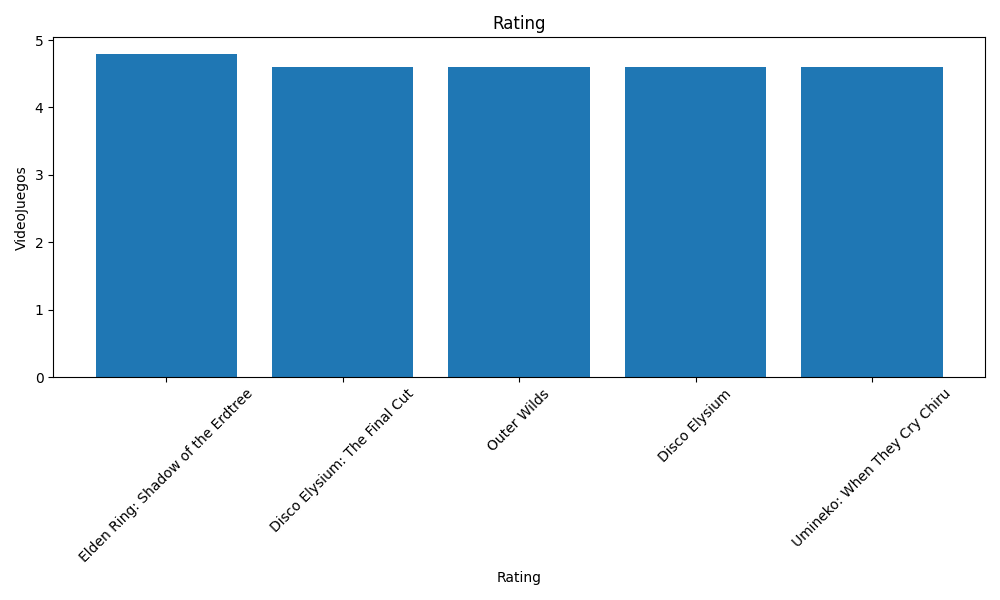
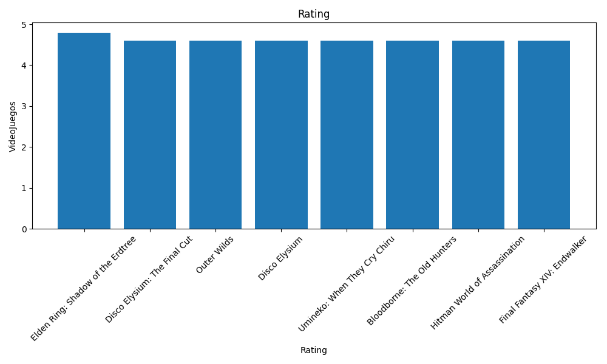

# Videogames
Proyecto simple que busca mostrar los conocimientos adquiridos en el curso de introducción a Ciencia de datos en Platzi

# Uso

Dentro del módulo `main.py` tenemos la función `raiting` que filtra los resultados del CSV con los siguientes parametros:
 - best_or_worst -> Especificando si quieres ordenar de Mejor juego a peor juego (Basandose en el raiting)
 - items -> Número de juegos que quieres que te muestre.

 ```python
if __name__ == '__main__':
    ## Rating
    dates = raiting(items=5, best_or_worst=True)

    # Llaves 
    keys = [data['Title'] for data in dates]

    # Valores 
    values = list(map(lambda x: float(x['Rating']) if x['Rating'].strip() else 0, dates))

    # Mostrar las estadisticas 
    plot_bar_graph(keys=keys, values=values, title='Rating')
 ```

 # Ejemplos
 > Top 5 mejores Juegos 

 

> Top 8 mejores juegos

 